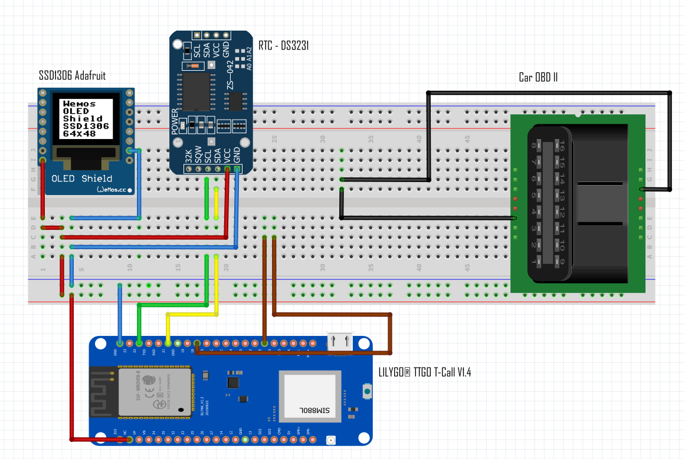

# 1. Hardware

O projeto é composto de dois dispositivos responsáveis por fazer a coleta e processamento das informações do veículo que será analisado.

## 1.1 LILYGO® TTGO T-Call V1.4

Conforme especificação do fabricante¹, esse Hardware tem o chipset ESP32² e é equipado com o módulo de conexão SIM800L para conexão com internet via rede GSM.
Além dos pinos padrões, herdados do ESP32, o dispositivo também contém pinos de entrada (microfone) e saída (alto-falante) de audio, que foram herdados do módulo de conexão GSM SIM800L.
Diferente dos módulos de desenvolvimento da familia do ESP32, este dispositivo conta com uma entrada USB-C e uma entrada para alimentação via bateria.
Este Hardware é open-source e sua documentação pode ser consultada no GitHub através do repositório LilyGo-T-Call-SIM800 do usuário Xinyuan-LilyGO¹
A escolha deste disposivo foi baseado na capacidade de processamento, comunicação wireless, consumo de bateria, tamanho físico e custo financeiro.

## 1.2 Raspberry Pi 4

Como uma alternativa a núvem, foi utilizado neste projeto o Raspberry Pi 4 - Model B para o processamento e armazenamento dos dados coletados pelo dispositivo menciado em 1.1.
No projeto, o Raspberry é utilizado com um sistema operacional Linux para suportar a arquitetura de softwares que recebem, processam e armazenam os dados recebidos.
A escolha deste dispositivo foi baseado na comparação de processamento vs. custos, entre uma máquina on-cloud e on-promise, onde o custo da máquina on-promise acaba sendo mais barato.
O dispositivo é criado pela Raspberry Pi Foundation e não é open-source.

## 1.3 Protótipo

¹https://github.com/Xinyuan-LilyGO/LilyGo-T-Call-SIM800
²https://www.espressif.com/en/products/socs/esp32